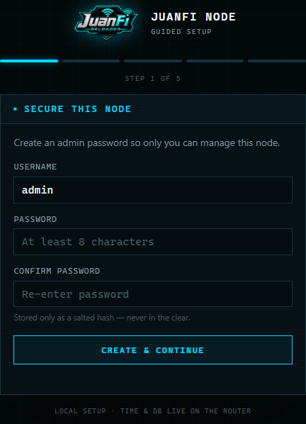
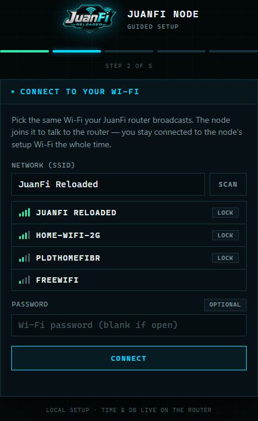
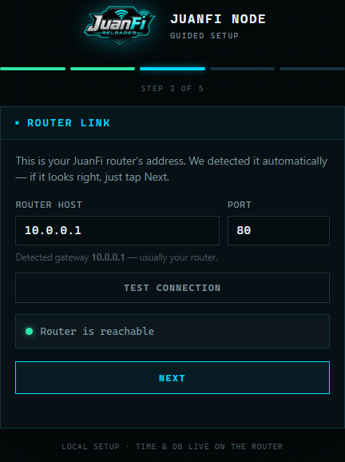
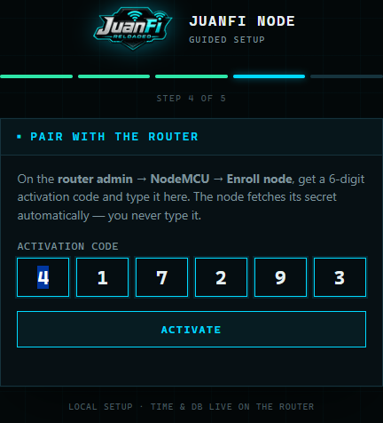
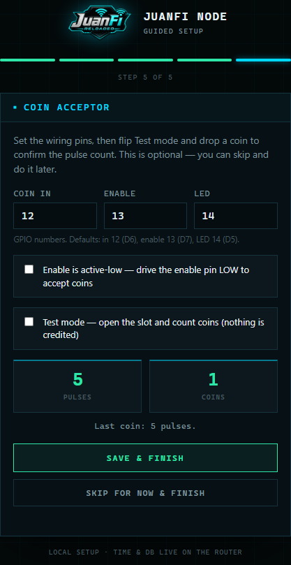

# Enrolling an ESP8266 Coin-Acceptor Node

A freshly-flashed JuanFi‑RE coin‑acceptor **node** (NodeMCU / ESP8266) now boots into a
**guided Setup wizard** — connect to it from a phone and it walks you through securing
it, joining your Wi‑Fi, linking the router, and **pairing**. Pairing is code‑based: the
router shows a 6‑digit code, you type it on the node, and the node fetches its auth
**token automatically** — you never copy/paste the token by hand.

There are two consoles involved, don't mix them up:

| Console | Where | Title |
|---|---|---|
| **Node** (the coin acceptor) | the node's setup Wi‑Fi at `http://192.168.4.1/` | **JUANFI NODE — Guided Setup** |
| **Router** (the PisoWiFi) | `http://10.0.0.1/admin/` | **JUANFI RELOADED — PisoWiFi Console** |

---

## Prerequisites

- The node is **flashed** with **both** the JuanFi‑RE **firmware** *and* **LittleFS**
  images (see the ESP8266 section in the [README](README.md)). The wizard UI lives in
  the LittleFS image — firmware alone won't show it.
- **Re‑using a node that was provisioned before? Erase the chip first.** The node's
  config (Wi‑Fi + pairing token) is backed up in a flash sector that **survives a
  re‑flash**, so a previously‑paired node comes back *paired* and skips the wizard
  (you'll see the normal Sign‑in page, not Setup). Full‑erase, then flash both images:
  ```sh
  esptool.py --port <PORT> erase_flash
  esptool.py --port <PORT> --baud 460800 write_flash 0x0      JuanFi-RE-ESP8266-node-Wireless-firmware-v0.2.bin
  esptool.py --port <PORT> --baud 460800 write_flash 0x300000 JuanFi-RE-ESP8266-node-littlefs-v0.2.bin
  ```
- The router is up and reachable at **`http://10.0.0.1/admin/`** (default login
  `admin` / `admin`).

---

## Connect to the node

On a phone/laptop, join the open Wi‑Fi network **`CVFi-Node-Setup`**. The "sign in to
network" sheet pops up automatically and opens the wizard at **`http://192.168.4.1/`**
(if it doesn't pop, open that address manually). You stay on this setup Wi‑Fi for the
whole process — the node joins your router Wi‑Fi in the background without kicking you
off.

---

## Step 1 — Secure this node

Create an **admin password** for the node (min 8 characters), then tap **Create &
continue**. It's stored only as a salted hash and gates the node's console from here on.



---

## Step 2 — Connect to your Wi‑Fi

Tap **SCAN**, pick your router's SSID (e.g. **`JuanFi Reloaded`**) from the list, enter
its Wi‑Fi **password** (leave blank for an open hotspot), and tap **Connect**. The node
joins as a station **without rebooting** and shows **Connected** once it's on — you're
still on the setup Wi‑Fi the whole time.



---

## Step 3 — Router link

The node **auto‑detects** your router's address (the Wi‑Fi gateway — almost always
**`10.0.0.1:80`**) and pre‑fills it. Tap **TEST CONNECTION** to confirm it's reachable,
then **NEXT**. Only change these if your router uses a different address.



---

## Get your activation code (on the router)

Leave the wizard on **Step 4** for a moment and open the **router** admin
**`http://10.0.0.1/admin/`** → **NodeMCU** (under *Subvendos*) → click **ENROLL NODE**
(top‑right of the NodeMCU card).

> **The node isn't listed here yet — that's expected.** An unpaired node has no token,
> so it stays invisible until it activates in the next step.

A dialog shows a **6‑digit activation code** and *"Waiting for the node to activate…"*.
The code expires in 10 minutes.


---

## Step 4 — Pair with the router

Back on the node wizard, type the **6‑digit code** into the boxes. Each digit **advances
to the next box automatically** (backspace steps back, and you can paste the whole code).
When all six are in, the node activates: it exchanges the code with the router, **receives
its token automatically**, and saves it — you never type the token.



The router dialog flips to **"✓ Activated"** and the node will come online shortly.

---

## Step 5 — Coin acceptor

Set the coin‑acceptor **wiring pins** (defaults **in 12 / enable 13 / LED 14**, i.e.
D6/D7/D5), flip **Test mode**, and drop a coin to confirm the **pulse count** matches the
coin's value. Not wiring the acceptor yet? Tap **Skip for now & finish**. Either way,
**Finish** turns test mode off and reboots the node.



---

## Done

After the reboot the node joins your router Wi‑Fi and appears **ONLINE** and **paired**
in the router's **NodeMCU** list. From now on you reach the node's console at its STA IP
or **`cvfi-node-<id>.local`** (the `CVFi-Node-Setup` AP is gone), and it shows the normal
Sign‑in page — the wizard only runs while a node is unpaired.


---

## After enrollment

- **Re‑run coin calibration** any time from the node console → **Coin Tester**.
- **Rates & points** — set on the **router** under **Coin Rates** (global), or per‑node
  overrides on the router's **NodeMCU → Edit** page.
- **Rename / manage** the node from the router's **NodeMCU** list (Edit / Unpin / Delete).

---

## Troubleshooting

| Symptom | Fix |
|---|---|
| No `CVFi-Node-Setup` AP after flashing | The node kept an old config in its EEPROM backup — **erase the chip** and reflash **both** images (see Prerequisites). |
| Wizard doesn't show — it goes straight to a **Sign‑in** page | The node is still **paired** (its saved token survived the re‑flash). Do a full **`erase_flash`** first, then reflash both images. |
| Setup page blank on first open | Fixed in node **v0.2** (the setup page is now a single self‑contained response). Make sure you flashed the **v0.2** LittleFS image. |
| Node not listed on the router *before* pairing | **Expected.** An unpaired node has no token, so it isn't shown. Click **ENROLL NODE** and it appears only after it activates. |
| **"code rejected or expired"** on pairing | The code lives 10 min and is single‑use. Click **ENROLL NODE** again for a fresh code, and make sure Step 3 showed the router as reachable. |
| Node stays **OFFLINE** after pairing | It isn't reaching the router. Re‑check the Wi‑Fi password (Step 2) and that the router host (Step 3) is correct. |
| Node online but no coins register | Re‑check the **Coin Acceptor** pins (Step 5 / Coin Tester) and the coin rates on the router. |
