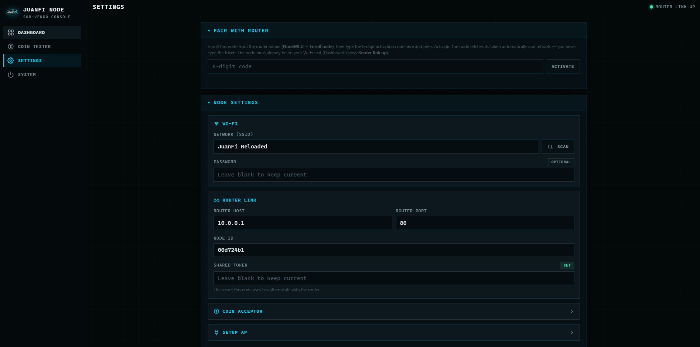
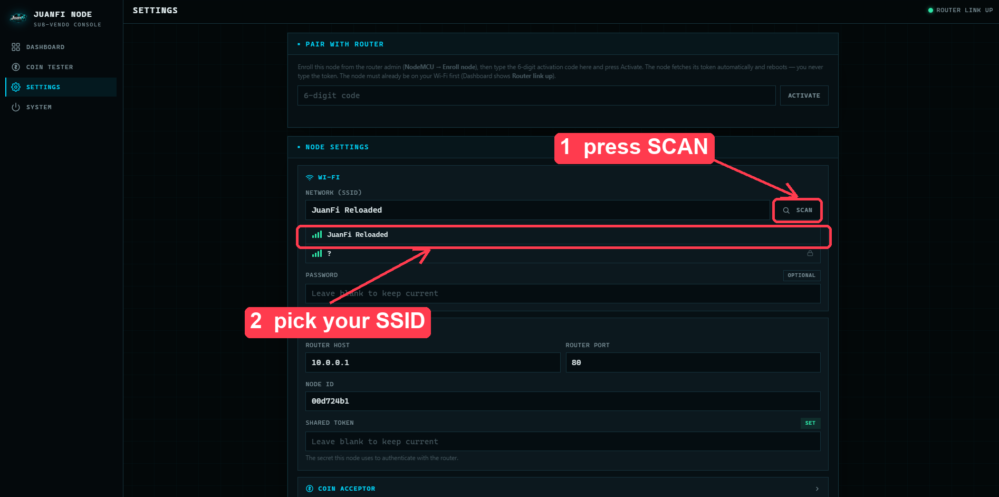
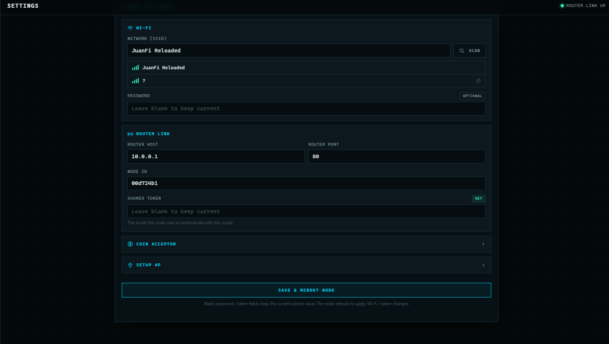
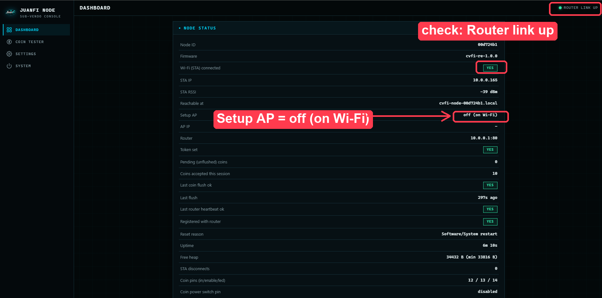
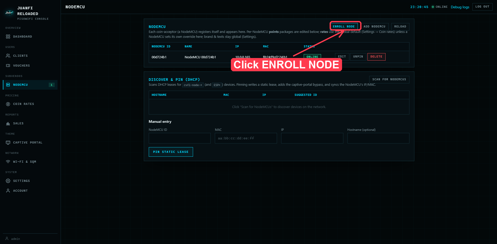
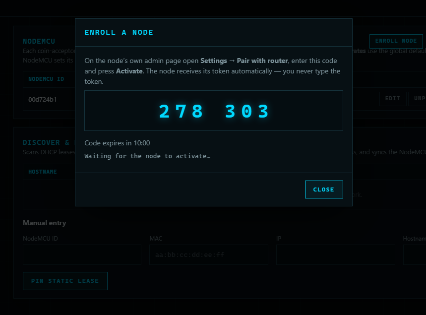
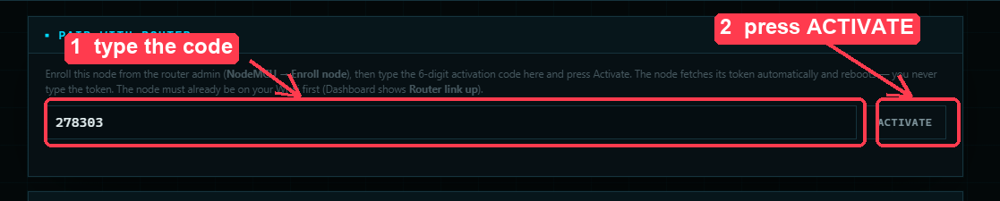
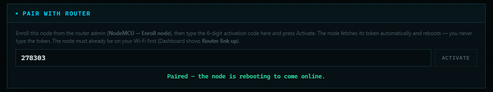
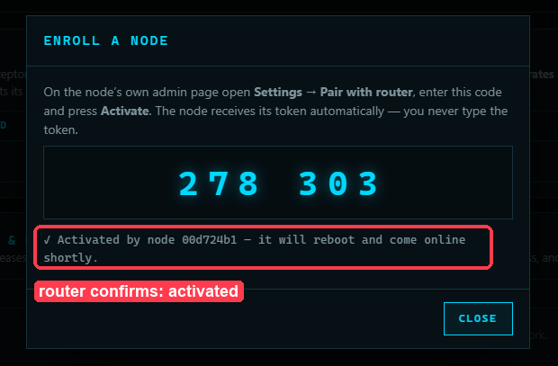

# Enrolling an ESP8266 Coin-Acceptor Node

This guide walks you through bringing a JuanFi‑RE coin‑acceptor **node** (NodeMCU /
ESP8266) online and **pairing** it with the router. Pairing is code‑based: the router
shows a 6‑digit code, you type it on the node, and the node fetches its auth **token
automatically** — you never copy/paste the token by hand.

There are two consoles involved, don't mix them up:

| Console | Where | Title |
|---|---|---|
| **Node** (the coin acceptor) | the node's own IP / setup AP | **JUANFI NODE — Sub‑Vendo Console** |
| **Router** (the PisoWiFi) | `http://10.0.0.1/admin/` | **JUANFI RELOADED — PisoWiFi Console** |

---

## Prerequisites

- The node is **flashed** with the JuanFi‑RE firmware **and** LittleFS image (see the
  ESP8266 section in the [README](README.md)). If you're re‑using a node that was ever
  provisioned before, **erase the chip first** or it will silently keep its old Wi‑Fi
  and never show the setup AP.
- The router is up and reachable at **`http://10.0.0.1/admin/`** (default login
  `admin` / `admin`).

---

## Part A — Get the node onto your Wi‑Fi

**1. Connect to the node's setup Wi‑Fi.**
On a phone/laptop, join the open network **`CVFi-Node-Setup`**. The "sign in to
network" sheet usually pops up automatically; if not, open **`http://192.168.4.1/`**.
On first access the node asks you to **create an admin password**, then signs you in.

**2. Point the node at your router's Wi‑Fi.**
Go to **Settings → Node settings → Wi‑Fi**:

*The node's own console (JUANFI NODE — Sub‑Vendo Console), Settings page.*

- Press **SCAN** and pick your router's SSID (e.g. **`JuanFi Reloaded`**) from the list.
- Enter the Wi‑Fi **password** if your router Wi‑Fi has one (leave blank to keep the
  current value / for an open hotspot).
- Under **Router link**, confirm **Router host = `10.0.0.1`** and **Router port = `80`**
  (the defaults).
- Press **SAVE & REBOOT NODE**.

> Blank password / token fields keep the current stored value. The node reboots to apply
> the Wi‑Fi change.

*Press SCAN and pick your router's SSID from the list.*

*Scroll to the bottom and press SAVE & REBOOT NODE.*

**3. Confirm the node joined the router.**
After it reboots, open the node's **Dashboard**. You want to see:
- top‑right **ROUTER LINK UP**
- **Wi‑Fi (STA) connected = YES**, a **STA IP** (e.g. `10.0.0.165`)
- **Setup AP: off (on Wi‑Fi)** — the setup AP drops once the node is on the router Wi‑Fi
- **Reachable at `cvfi-node-<id>.local`** (e.g. `cvfi-node-00d724b1.local`)

From now on you reach the node's console at that STA IP or `cvfi-node-<id>.local`
(the `CVFi-Node-Setup` AP is gone).

*Node Dashboard → Node status: Wi‑Fi (STA) connected = YES, Setup AP off (on Wi‑Fi).*

---

## Part B — Enroll (pair) the node with the router

**4. Start enrollment on the router.**
Open the router admin **`http://10.0.0.1/admin/`** → **NodeMCU** (under *Subvendos*)
and click **ENROLL NODE** (top‑right of the NodeMCU card).

> **The node is not listed here yet — that's expected.** An unpaired node has no auth
> token, so the router rejects its registration and it stays invisible in this list.
> The node does **not** enroll itself; you start pairing from this button. It appears
> here (as **ONLINE**) only *after* it activates in the next steps.

A dialog shows a **6‑digit activation code** (e.g. `278 303`) and *"Waiting for the node
to activate…"*. The code expires in 10 minutes.

*Router admin → NodeMCU (Subvendos): click ENROLL NODE to start pairing.*

*The router shows a 6‑digit code and waits for the node to activate.*

**5. Enter the code on the node.**
On the node's console go to **Settings → Pair with router**, type the **6‑digit code**,
and press **ACTIVATE**.
- The node exchanges the code with the router, **receives its token automatically**,
  saves it, and reboots.
- The node shows **"Paired — the node is rebooting to come online."**

*On the node: Settings → Pair with router → type the 6‑digit code → ACTIVATE.*

*The node confirms: "Paired — the node is rebooting to come online."*

**6. Done.**
The router dialog updates to **"✓ Activated by node `<id>` — it will reboot and come
online shortly."** After the reboot the node appears **ONLINE** and **paired** in the
router's **NodeMCU** list. You never typed the token.

*Router: "✓ Activated by node … — it will reboot and come online shortly."*

---

## After enrollment

- **Coin acceptor pins** — set on the node under **Settings → Coin Acceptor** (defaults
  D5/D6/D7 = GPIO14/12/13). Use **Coin Tester** on the node to verify pulses.
- **Rates & points** — set on the **router** under **Coin Rates** (global), or per‑node
  overrides on the router's **NodeMCU → Edit** page.
- **Rename / manage** the node from the router's **NodeMCU** list (Edit / Unpin / Delete).

---

## Troubleshooting

| Symptom | Fix |
|---|---|
| No `CVFi-Node-Setup` AP after flashing | The node kept an old config in EEPROM — **erase the chip** and reflash firmware + LittleFS (see README). |
| Node not listed on the router *before* pairing | **Expected.** An unpaired node has no token, so it isn't shown. Don't wait for it — click **ENROLL NODE** (Part B) and it appears only after it activates. |
| Node stays **OFFLINE** *after* pairing | It isn't reaching the router. On the node Dashboard confirm **Router link up** (STA connected) *and* **Last router heartbeat ok**; recheck the SSID/password and **Router host = 10.0.0.1** in node Settings. |
| **"code rejected or expired"** on Activate | The code lives 10 min and is single‑use. Click **ENROLL NODE** again on the router for a fresh code, and make sure the node shows **Router link up** first. |
| Node online but no coins register | Check the node's **Coin Acceptor** pins and test with **Coin Tester**; confirm the coin rates on the router. |
