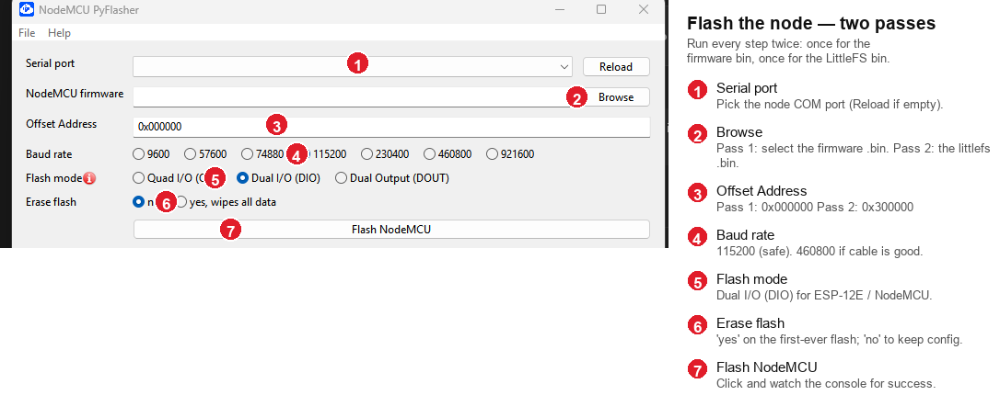

# JuanFi Reloaded — Flashable Releases

Prebuilt, ready-to-flash firmware for **JuanFi Reloaded (JuanFi‑RE)** — a
clean‑room, fully‑offline PisoWiFi captive portal (coin / voucher / points /
free‑time) built on stock **OpenWrt**, plus the matching **ESP8266 coin‑acceptor
node** firmware.

> Downloads live on the [**Releases**](../../releases) page. This repository holds
> only the release notes and checksums — the binaries are attached as release
> assets.

---

## What's in the current release

| Component | Files | Version |
|---|---|---|
| Router images — all supported router and access-point profiles below | `JuanFi-RE-*-beta-0.4.62.bin` | **beta 0.4.62** |
| PC / SBC appliance images — Raspberry Pi, x86‑64, and Orange Pi | `JuanFi-RE-*-beta-0.4.62*.img.gz` | **beta 0.4.62** |
| ESP8266 node — firmware + LittleFS UI | Available from the beta 0.4.61 release | **v0.4** _(unchanged)_ |

> **What's new in beta 0.4.62?** See [`CHANGELOG.md`](CHANGELOG.md): improved
> node settings and reliability, system-aware portal appearance, broader USB
> Ethernet support for appliance images, and more reliable appliance updates.
> Setting up a coin‑acceptor node? See the
> [Node enrollment guide](NODE-ENROLLMENT.md).

Verify downloads against [`SHA256SUMS.txt`](SHA256SUMS.txt):

```sh
sha256sum -c SHA256SUMS.txt
```

PC / SBC appliance checksums are provided separately as
`SHA256SUMS-appliance.txt` with the release assets.

---

## Router images

The production router images are stock **OpenWrt** (24.10.3 for most; the Linksys
EA8300 is also offered on **23.05.5**, and the RT‑AX52 dev‑kit is on 25.12.0), with the
JuanFi‑RE portal + admin app (PHP 8 + SQLite + nftables captive portal) baked into the
rootfs. They self‑initialise on first boot — no license server, no phone‑home, no
encrypted app blob.

| Device | OpenWrt target / profile | Notes |
|---|---|---|
| Comfast **CF‑N5 v2** | `ramips/mt7621` · `zbtlink_zbt-wg3526-16m` | Not a mainline OpenWrt board; built on the ZBT **WG3526 (16 MB)** profile, which matches the CF‑N5's actual radios — **MT7603E (2.4 GHz) + MT7612E (5 GHz)** — so both bands work. |
| **ZBT WG3526** (16 MB) | `ramips/mt7621` · `zbtlink_zbt-wg3526-16m` | **Officially supported** by OpenWrt (MT7621, 16 MB flash, MT7603+MT7612 radios). This is the native device for the profile the CF‑N5 v2 borrows, so the image is identical — use this file on an actual WG3526. [Device page](https://openwrt.org/toh/zbtlink/zbt_wg3526). |
| **AIRPHO AR‑W410** | `ramips/mt7621` · `zbtlink_zbt-wg3526-16m` | ZBT **WG3526 (16 MB)** clone — same MT7621 SoC and MT7603E (2.4 GHz) + MT7612E (5 GHz) radios. Ships as its own `JuanFi-RE-airpho-ar-w410-…​.bin` download, which is a **byte‑identical copy** of the ZBT WG3526 image. It reports the ZBT board name, so **in‑product updates track the ZBT WG3526 asset** (same image). |
| Ruijie **RG‑EW1200G PRO v1.1** | `ramips/mt7621` · `ruijie_rg-ew1200g-pro-v1.1` | **Officially supported** by OpenWrt (since 24.10.0) — a first‑class device profile. |
| **Newifi D2** (D‑Team) | `ramips/mt7621` · `d-team_newifi-d2` | **Officially supported** by OpenWrt (MT7621, 32 MB flash / 512 MB RAM). [Device page](https://openwrt.org/toh/hwdata/d-team/d-team_newifi_d2). |
| Linksys **EA8300** (AC2200) | `ipq40xx/generic` · `linksys_ea8300` | **Officially supported** by OpenWrt (Qualcomm **IPQ4019**, tri‑radio, NAND, dual‑partition). Provided in **two builds: OpenWrt 23.05.5 (recommended) and 24.10.3**. ⚠️ Upgrading this board to 24.10.x can fail to boot / sysupgrade ([openwrt#17979](https://github.com/openwrt/openwrt/issues/17979)) — prefer the **23.05.5** image. Our `.bin` is a **sysupgrade** image; first install from stock Linksys firmware uses the OpenWrt **factory** flow. [Device page](https://openwrt.org/toh/linksys/ea8300). |
| Linksys **WRT1900ACS** | `mvebu/cortexa9` · `linksys_wrt1900acs` | **Officially supported** by OpenWrt (Marvell **Armada 385**, ARMv7, 128 MB NAND / 512 MB RAM). Dual‑firmware (auto‑failover) device — first install from stock uses the OpenWrt **factory** image; our `.bin` is a **sysupgrade** image. [Device page](https://openwrt.org/toh/linksys/wrt1900acs). |
| **EDUP EP‑RT2983** (Wi‑Fi 6) | `ramips/mt7621` · `edup_ep-rt2983` | **Officially supported** by OpenWrt (MediaTek **MT7621AT** + MT7915 802.11ax, 5× GbE, 128 MB NAND / 256 MB RAM). Built on **OpenWrt 25.12.4** (added after the 24.10 series). NAND device — our `.bin` is a **sysupgrade** image; first install from stock uses the OpenWrt **factory** image. [Device page](https://openwrt.org/toh/hwdata/edup/edup_ep-rt2983). |
| ASUS **RT‑AX52** _(dev kit)_ | `mediatek/filogic` · `asus_rt-ax52` | **Dev‑kit / experimental** build on **OpenWrt 25.12.0** (aarch64) — the development reference board, published for testers. Not on the 24.10.3 base above; validate carefully. |

### First‑boot defaults (vendo appliance)

Each image comes up ready to run as a PisoWiFi gateway:

- **LAN `10.0.0.1/24`** — the common vendo gateway address; the portal and admin are
  served here.
- **Wi‑Fi enabled on both bands** (2.4 GHz + 5 GHz), **open** (auth is the captive
  portal, not a Wi‑Fi key), SSID **`JuanFi Reloaded`**.
- **Admin console** at **`http://10.0.0.1/admin/`** starts with a first-run setup
  screen. Choose the sole admin username and password.

### Flashing the router

**There is no custom flashing** — these are standard OpenWrt sysupgrade images. Flash
your device's image exactly as you would any OpenWrt image: `sysupgrade` over SSH (or
your device's usual OpenWrt flashing method). Follow the official OpenWrt guide:
<https://openwrt.org/docs/guide-user/installation/generic.flashing>

> **Switching profiles / first install:** if the device is currently running a
> *different* OpenWrt board profile (e.g. an earlier build of this image on a
> different profile, or stock vendor firmware), `sysupgrade` will refuse the image
> as "not compatible". Use **`sysupgrade -F -n`** (force, wipe config) over SSH, or
> flash via the device's **U‑Boot recovery** (MT7621: hold reset, PC on
> `192.168.1.x`, recovery page at `192.168.1.1`).

After reboot the portal is served at the router's LAN IP; the admin panel is at
`/admin/` (complete the first-run admin setup when prompted).

⚠️ **Beta.** Flash at your own risk on hardware you can recover. Each image is only
validated on its listed device.

### Something not working? Send us debug logs

Every image includes a one-tap diagnostics bundle. Even if the admin panel or portal
is misbehaving, open **`http://10.0.0.1/cgi-bin/debug-logs`** in a browser (or tap
**Download debug logs** on the admin login page) — it downloads a small `.tar.gz`
capturing first-boot script results, DB/Wi-Fi/network/firewall state, and system logs
(with secrets redacted). Send that file to support and we can see exactly where it
failed.

---

## PC & single‑board computer images (Raspberry Pi / x86‑64 / Orange Pi)

Besides the router `.bin` images above, JuanFi‑RE also ships as **whole‑disk
appliance images** for PCs and single‑board computers. These are **not** OpenWrt
sysupgrade files — they are gzipped disk images (`.img.gz`) you **write to a USB
stick, SD card, or SSD/eMMC** with a tool like **Rufus** or **balenaEtcher**, then
boot the machine from that media.

| Platform | File pattern | Boot media |
|---|---|---|
| **Raspberry Pi 3 / 4 / 5** | `JuanFi-RE-raspberry-pi-{3,4,5}-…​.img.gz` | microSD card |
| **x86‑64 PC** — BIOS/Legacy | `JuanFi-RE-x86-64-…​.img.gz` | USB stick or internal SATA/NVMe disk |
| **x86‑64 PC** — UEFI/EFI | `JuanFi-RE-x86-64-…​-efi.img.gz` | USB stick or internal SATA/NVMe disk |
| **Orange Pi One / PC / Zero 3** | `JuanFi-RE-orange-pi-{one,pc,zero-3}-…​.img.gz` | microSD card |

> **BIOS vs EFI (x86 only):** use the plain `x86-64` image if your PC boots in
> Legacy/CSM mode, or the `x86-64-…-efi` image if it boots in UEFI mode. Modern
> mini‑PCs and laptops are almost always **UEFI** → pick the **`-efi`** file. If one
> won't boot, flip the BIOS boot‑mode setting or try the other image.

### What the appliance does on first boot

Each appliance image **configures its own network automatically** — no serial
console needed for a headless box:

- The **first wired Ethernet port becomes the internet uplink (WAN, DHCP client)** —
  plug it into your existing router/modem.
- The **onboard Wi‑Fi becomes the hotspot** (LAN), open SSID **`JuanFi Reloaded`**,
  gateway **`10.0.0.1`**. Any extra Ethernet ports fold into the LAN bridge.
- Admin console at **`http://10.0.0.1/admin/`** — complete the first-run admin setup.

So the flow is: **write the image → plug WAN cable into the first Ethernet port →
power on → join the `JuanFi Reloaded` Wi‑Fi → open `http://10.0.0.1/admin/`.**

> ⚠️ **x86 boards need onboard or USB Wi‑Fi** for the hotspot. A PC with no Wi‑Fi
> radio will still boot and route, but won't broadcast a hotspot until you add a
> supported USB Wi‑Fi adapter (or bridge a second Ethernet port to downstream APs).

### Writing the image with balenaEtcher (Windows / macOS / Linux — recommended)

[**balenaEtcher**](https://etcher.balena.io/) reads the `.img.gz` **directly** — you
do **not** need to unzip it first.

1. Download the correct `…​.img.gz` for your board (see the table above) and, if you
   like, verify it against [`SHA256SUMS.txt`](SHA256SUMS.txt) / the appliance
   checksums file.
2. Insert the USB stick / SD card. **Everything on it will be erased.**
3. Open balenaEtcher → **Flash from file** → pick the `.img.gz`.
4. **Select target** → choose the USB/SD device (double‑check the size so you don't
   pick your system disk).
5. **Flash!** and wait for the write + validate to finish. Eject when done.
6. Move the media to the target machine (or leave it in), plug the **WAN cable into
   the first Ethernet port**, and power on.

### Writing the image with Rufus (Windows)

[**Rufus**](https://rufus.ie/) writes raw disk images, but it **cannot read `.img.gz`
directly — decompress it to a plain `.img` first.**

1. **Unzip the image.** Right‑click the `…​.img.gz` and extract it (7‑Zip / WinRAR /
   Windows) so you have a plain **`…​.img`** file.
2. Insert the USB stick / SD card. **Everything on it will be erased.**
3. Open Rufus → **Device**: select your USB/SD drive (verify the size).
4. **Boot selection** → **SELECT** → choose the extracted **`.img`**.
5. If Rufus asks about writing mode, choose **Write in DD Image mode** (it usually
   auto‑detects this for raw disk images).
6. Leave partition scheme/target as detected, click **START**, confirm the erase
   warning, and wait for **READY**.
7. Safely eject, move the media to the target machine, plug the **WAN cable into the
   first Ethernet port**, and power on.

> **`dd` (macOS / Linux CLI) alternative:**
> ```sh
> gunzip -c JuanFi-RE-x86-64-24.10.3-beta-….img.gz | sudo dd of=/dev/sdX bs=4M status=progress conv=fsync
> ```
> Replace `/dev/sdX` with your target device (`lsblk` / `diskutil list`). **Wrong
> device = wiped disk** — check twice.

### Booting an x86 PC from the image

- Insert the USB stick (or install the flashed SSD/eMMC), enter the PC's boot menu
  (usually **F12 / F11 / Esc / F8** at power‑on), and select the USB/disk.
- To run permanently from an **internal disk**, flash the image **onto that disk**
  (via a USB‑to‑SATA adapter, or boot a live Linux USB and `dd` it), then boot from
  it normally.
- The image comes up headless — you don't need a monitor. Once it boots, look for the
  **`JuanFi Reloaded`** Wi‑Fi and browse to **`http://10.0.0.1/admin/`**.

> The image's partition is small; OpenWrt uses an overlay for config/data, so there's
> no need to pre‑expand it for normal use. Flash to media at least as large as the
> uncompressed `.img`.

⚠️ **Beta.** These appliance images self‑configure the network on first boot; if you
have a specific LAN/WAN layout, adjust it afterward in the admin / LuCI. Each image
is validated only on its listed platform.

---

## ESP8266 coin‑acceptor node

> 📖 **New to nodes? Start with the [Node enrollment guide →](NODE-ENROLLMENT.md)** —
> a step‑by‑step walkthrough (with screenshots) for getting a node onto Wi‑Fi and
> pairing it with the router.

The node needs **two** images flashed: the **firmware** and the **LittleFS**
filesystem (the node's web setup UI is served only from LittleFS).

- **One firmware for both node types** — pick **Wi‑Fi** (node joins the router
  Wi‑Fi as a station) or **Ethernet** (node connects by LAN cable via a W5500
  module) in the Setup wizard. Same bin for either.
- Flash the LittleFS image **before** provisioning; re‑flashing it later wipes the
  saved node‑type/Wi‑Fi/token/pin config.

### Flashing the node (esptool, ESP‑12E / NodeMCU)

These images are built for an **ESP‑12E / 4 MB flash, 1 MB LittleFS** (`eagle.flash.4m1m`)
layout, so the FS goes at **`0x300000`** (the FS bin is exactly `0xFA000` = 1,024,000 B):

```sh
# firmware (first bin) → 0x0
esptool.py --port <PORT> --baud 460800 write_flash 0x0 JuanFi-RE-ESP8266-node-firmware-v0.3.bin
# LittleFS (second bin) → 0x300000  (NOT 0x200000 — that is the 2 MB-FS layout)
esptool.py --port <PORT> --baud 460800 write_flash 0x300000 JuanFi-RE-ESP8266-node-littlefs-v0.3.bin
```

Or let PlatformIO place the FS for you: `pio run -e esp12e -t uploadfs`.

#### GUI alternative — NodeMCU PyFlasher (no command line)

[**NodeMCU PyFlasher**](https://github.com/marcelstoer/nodemcu-pyflasher/releases)
(`NodeMCU-PyFlasher.exe`) wraps `esptool`. Use **5.x** — it has the
**Offset Address** field both bins need. Flash **twice**, firmware first:



1. **Serial port** ➊ — the node's COM port (**Reload** if empty; install the
   CP2102/CH340 USB‑serial driver first if none appears).
2. **NodeMCU firmware** ➋ — Browse to the **firmware** bin
   (`JuanFi-RE-ESP8266-node-firmware-v0.3.bin`).
3. **Offset Address** ➌ — `0x000000` for the firmware.
4. **Baud rate** ➍ `115200` · **Flash mode** ➎ `Dual I/O (DIO)` ·
   **Erase flash** ➏ `yes` on a first‑ever flash (else `no`).
5. Click **Flash NodeMCU** ➐ and wait for success in the console.
6. **Second pass:** load the **LittleFS** bin
   (`JuanFi-RE-ESP8266-node-littlefs-v0.3.bin`) in ➋ with
   **Offset Address ➌ = `0x300000`**, set Erase flash to `no`, and Flash again.

> ⚠️ The LittleFS bin **must** go at `0x300000`, not `0x0`. On the first pass the
> firmware sits at `0x0`; if you leave the offset at `0x0` for the second pass you
> will overwrite the firmware. Older PyFlasher builds (pre‑5.0) have no offset
> field — use `esptool` above instead.

### Setting up the node after flashing

> 📖 **Full step‑by‑step guide: [NODE-ENROLLMENT.md](NODE-ENROLLMENT.md)** — getting the
> node onto Wi‑Fi and pairing it with the router (with troubleshooting).

Once **both** images are flashed, bring the node online from any phone or laptop —
no `curl`, and you never type the router token by hand:

**1. Connect to the node.** In your Wi‑Fi list, join the node's setup network
**`CVFi-Node-Setup`** (open, no password). The "sign in to network" sheet usually
pops automatically; if it doesn't, open `http://192.168.4.1/`. On first access the
node asks you to **create an admin password**, then signs you in to the node's
setup UI.

**2. Put the node on the router Wi‑Fi.** In **Settings → Node settings**, enter your
router's Wi‑Fi SSID/password (and the router's IP/port if it isn't the
`10.0.0.1:80` default), then **Save & reboot**. When it comes back, the
**Dashboard** should show **Router link up** — the node is now on the router
network.

**3. Enroll with an activation code.** The router hands the node its pairing token
through a one‑time code:

1. In the **router admin**, open the **Nodes** page and click **Enroll node** — a
   **6‑digit activation code** appears and the panel waits for the node.
2. On the node's UI, go to **Settings → Pair with router**, type that 6‑digit code,
   and press **Activate**. (The Dashboard must already show **Router link up**.)
3. The node exchanges the code with the router, receives its token, saves it, and
   **reboots paired**. The router's **Nodes** page then shows it online.

The token is fetched automatically and is never displayed on either side. A
wrong/expired/already‑used code shows *"code rejected or expired"* — just generate
a new one on the router and try again.

---

## Building from source

These binaries are built from the [JuanFi Reloaded source](https://openwrt.org/)
with the OpenWrt Image Builder (router) and PlatformIO (`espressif8266`, ESP node).
See the source repo's `firmware/openwrt/IMAGEBUILDER.md` and
`firmware/esp8266-node/platformio.ini`.

---

_JuanFi Reloaded is an independent, clean‑room implementation. Not affiliated with
Comfast, ZBT, or any coin‑acceptor vendor._
